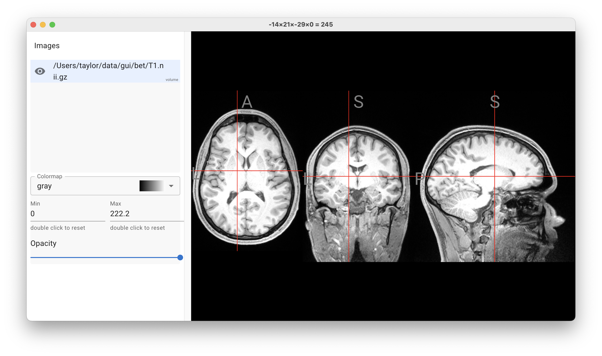

# NiiVue Desktop

Niivue Desktop is a cross-platform app for viewing medical imaging data.

It is built using [Electron](https://www.electronjs.org/) and [Niivue](https://github.com/niivue/niivue).

## Current features

- Load and view volumetric medical imaging data. See supported volume formats [here](https://github.com/niivue/niivue?tab=readme-ov-file#supported-formats)
- View data in 3D, 2D, and simultaneous 2D/3D
- Adjust window/level (contrast), zoom, and pan
- Measure distances

## Planned features

- Load and view medical imaging data in over 30 [formats](https://github.com/niivue/niivue?tab=readme-ov-file#supported-formats) (both volume and surface data)
- Mix volume and surface data in the same view
- Expose powerful drawing tools for annotating and segmenting clinical images (e.g. stroke, tumor, and other pathology)
- Save your scene for archiving or sharing with others

## Installation

Download the latest release from the [releases page](https://github.com/niivue/desktop/releases)

## Screenshots

### Basic single volume

## Development

### Prerequisites

- [Node.js](https://nodejs.org/en/)

### Getting started

1. Clone the repository
1. `cd` into the repository
1. Install dependencies with `npm install`
1. Run the app with `npm run dev` (launches the app with hot-reloading for the UI)
1. Make changes to the UI code and see them reflected in the app
1. Make changes to the main process code (anything electron related) and restart the app to see them reflected
1. Build the app with:
   - `npm run make:macArm` for macOS ARM (apple silicon)
   - `npm run make:macIntel` for macOS x64 (intel)
   - `npm run make:linux` for linux x64

## Similar projects and alternatives

- [3D Slicer](https://www.slicer.org/)
- [ITK-SNAP](http://www.itksnap.org/pmwiki/pmwiki.php)
- [FSLeyes](https://fsl.fmrib.ox.ac.uk/fsl/fslwiki/FSLeyes)
- [Mango](http://ric.uthscsa.edu/mango/)
- [MRIcroGL](https://www.nitrc.org/projects/mricrogl/)

## License

Niivue Desktop uses the [BSD-2-Clause](https://opensource.org/licenses/BSD-2-Clause) license.
